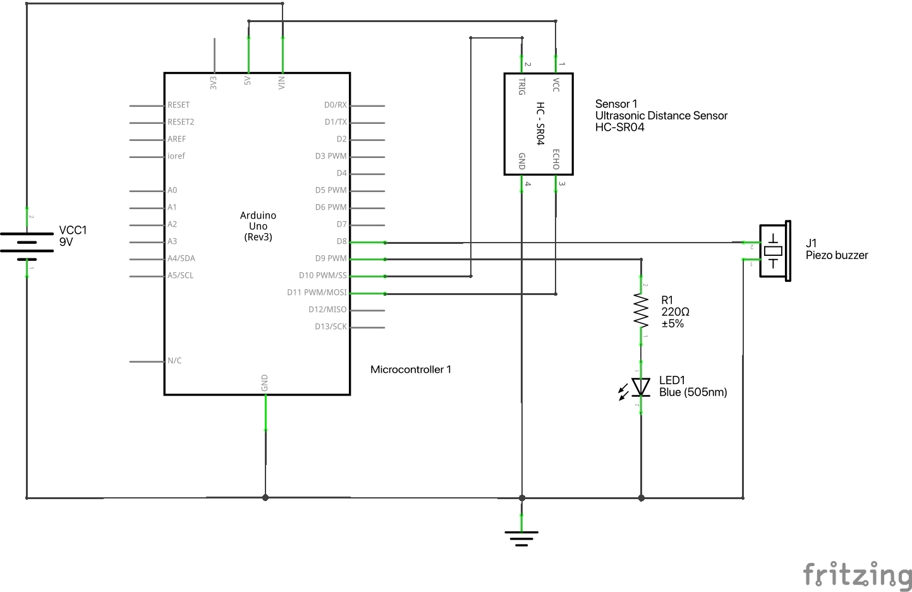

# Distance Sensor Gate with Arduino

## Overview
This project creates an interactive **distance-based gate** using an **ultrasonic sensor (HC-SR04)**, a **blue LED**, and an optional **piezo buzzer**. 

- As a person or object approaches, the **LED gradually fades in**.
- When they move away, the **LED fades out**.
- A **buzzer beeps when the gate opens and closes**.
- The system runs on a **finite state machine (FSM)** to ensure smooth transitions.

This can be used for **interactive installations**, **shadow boxes**, or **proximity-based lighting effects**.

Also check out [a more bare-bones project using the ultrasonic distance sensor](https://projecthub.arduino.cc/Isaac100/getting-started-with-the-hc-sr04-ultrasonic-sensor-7cabe1) on Arduino Project Hub.

The code is in **[DistanceSensorGate.ino](DistanceSensorGate.ino)**.
Click "Raw" to get the code, then paste it into the [Arduino IDE](https://www.arduino.cc/en/software)
and upload the program to your Arduino.

---

## How It Works
1. The **ultrasonic sensor** measures distance.
2. If the object is **close enough for a set time**, the **gate activates**:
   - **LED fades in** (PWM effect)
   - **Buzzer plays an entry tone**
3. When the object **moves away past a second threshold**, the **gate deactivates**:
   - **LED fades out**
   - **Buzzer plays an exit tone**
4. The system **smooths sensor readings** to prevent flickering.

---

## Components
| Component          | Function |
|-------------------|----------|
| **Arduino Uno**   | Controls the system |
| **HC-SR04**       | Measures distance |
| **Blue LED**      | Indicates gate status |
| **220Ω Resistor** | Limits LED current |
| **Piezo Buzzer**  | Provides audio feedback (optional) |
| **Jumper Wires**  | Connects components |
| **Breadboard**    | For prototyping |

---

## Example build
📌 *There's some extra LEDs in the picture which are not part of the project. Also, this build does not match the breadboard layout diagram.*

## Circuit Diagram
### **Breadboard Layout**  
📌 *The ultrasonic sensor plugs into the board and points away from the Arduino (towards the top of the screen, not into the screen as depicted).*  

### **Schematic**

---

## Wiring Guide
### **Ultrasonic Sensor (HC-SR04)**
- **VCC** → 5V  
- **GND** → GND  
- **TRIG** → Pin **10**  
- **ECHO** → Pin **11**  

### **LED**
- **Anode (+)** → **220Ω Resistor** → Pin **9**  
- **Cathode (-)** → GND  

### **Piezo Buzzer** (optional)
- **Positive (+)** → Pin **8**  
- **Negative (-)** → GND  

---

## Operation
1. **Upload the provided code** to the Arduino.
2. Place an object **within ~100 cm** → The **LED fades in** and the **buzzer beeps**.
3. Stay in range for **250ms** to activate the gate.
4. Move **beyond 200 cm** for **1 second** → The **LED fades out** and the **buzzer signals exit**.

---

## Adjusting the Behavior
- **Change `GATE_TRIGGER_DISTANCE`** *(default: 100 cm)* to adjust the activation range.
- **Modify `GATE_RELEASE_DISTANCE`** *(default: 200 cm)* to change when the gate turns off.
- **Adjust `LED_FADE_STEP`** *(default: 5)* for a slower or faster fade.
- **Customize `beepTriggered()` and `beepReleased()`** for different entry/exit sounds.

---

## Next Steps
- Integrate into a **shadow box or two-way mirror** for hidden reveals.
- Add **multiple sensors** for more interactive zones.
- Control **other outputs** (e.g., motors, relays) for expanded installations.

---

## License
This project is public domain. Modify, share, and improve it as needed!

https://creativecommons.org/public-domain/cc0/
